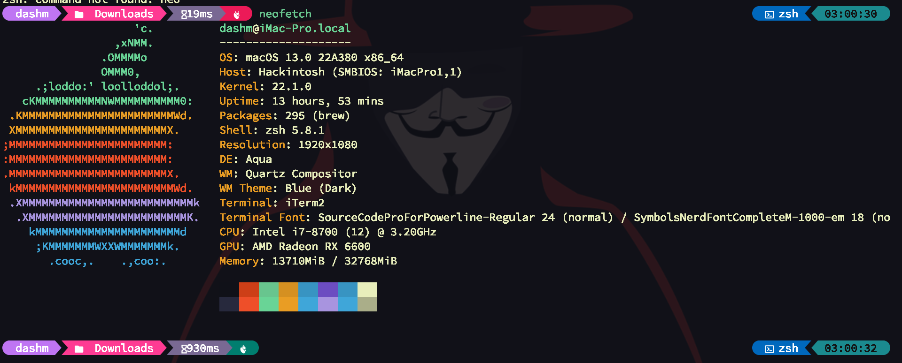

# Terminal Setup
---
<p align="center">
<a href="#scripts"> </a>
</p>

---



---


## Scripts

---

```bash

# Install Oh My Zsh
zsh -c "$(curl -fsSL https://raw.githubusercontent.com/ohmyzsh/ohmyzsh/master/tools/install.sh)"
# Plugins
zsh -c "$(curl -fsSL https://raw.githubusercontent.com/MurtadhaM/.dotfiles/main/oh-my-zsh-plugins.sh)"
# TMUX
zsh -c "$(curl -fsSL https://raw.githubusercontent.com/MurtadhaM/.dotfiles/main/tmux.sh)"
# Github Copilot CLI
zsh -c "$(curl -fsSL https://raw.githubusercontent.com/MurtadhaM/.dotfiles/main/COPILOT_CLI.md)"

```

#### IMPORTANT: FONTS NEEDED ARE:
- [Symbols Nerd Font Mono](https://fonts.google.com/specimen/Symbols+NF)
- [Source Code Pro for Powerline](http://powerline.readthedocs.io/en/latest/installation/linux.html#fonts-installation)

| Method    | Command                                                                                           |
|:----------|:--------------------------------------------------------------------------------------------------|
 **OMZZSH**  |  <a align="center" href="https://raw.githubusercontent.com/ohmyzsh/ohmyzsh/master/tools/install.sh" target="_blank">OMZZSH</a> |
| **Plugins**  |  <a align="center" href="https://raw.githubusercontent.com/MurtadhaM/.dotfiles/main/oh-my-zsh-plugins.sh" target="_blank">Plugins</a> |
| **TERMINAL ENHANCEMENT**  | <a align="center" href="https://github.com/MurtadhaM/Infrastructure/tree/main/Administration/Colorize%20CLI" target="_blank">Colorize CLI</a> |
| Github Copilot CLI  | <a align="center" href="https://raw.githubusercontent.com/MurtadhaM/.dotfiles/main/COPILOT_CLI.md" target="_blank">Github Copilot CLI</a> |
| **Syntax**  | <a align="center" href="https://raw.githubusercontent.com/MurtadhaM/.dotfiles/main/p10k.zsh" target="_blank">Syntax</a> |
| **Theme**  | <a align="center" href="https://raw.githubusercontent.com/MurtadhaM/.dotfiles/main/p10k.zsh" target="_blank">Theme</a> |


---
### THEMES

[OH My Posh](https://ohmyposh.dev/docs/themes)

---


# Telnet & SSH Colorize Demo
---


---


# License
[MIT](https://raw.githubusercontent.com/MurtadhaM/.dotfiles/master/LICENSE)


# Author
<a href="">
          
        </a>
        
[Murtadha Marzouq.](https://www.findasnake.com)
