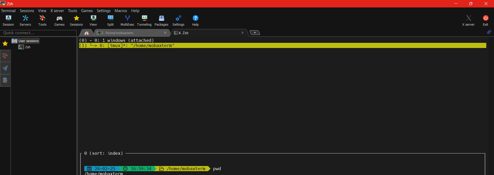

# Terminal Setup

<p ><a href="#scripts"> </a> </p>

---

- [ ]   Installation Scripts
  - [X] [Oh-My-Zsh](####-Install-Oh-My-Zsh-🚀)
  - [X] [Plugins](####-Plugins-🪙)
  - [X] [TMUX Config](####-TMUX-Config-🎨)
  - [x] [Colorize CLI](###-Colorize-CLI)

#### Install Oh My Zsh 🚀
```bash
zsh -c "$(curl -fsSL https://raw.githubusercontent.com/ohmyzsh/ohmyzsh/master/tools/install.sh)"
```

#### Plugins 🪙
```bash
zsh -c "$(curl -fsSL https://raw.githubusercontent.com/MurtadhaM/.dotfiles/main/oh-my-zsh-plugins.sh)"
```

#### TMUX Config 🎨
```bash
zsh -c "$(curl -fsSL https://raw.githubusercontent.com/MurtadhaM/.dotfiles/main/tmux.sh)"
```
---
### Colorize CLI
```bash
pip install https://raw.githubusercontent.com/MurtadhaM/Infrastructure/main/Administration/Colorize%20CLI/ChromaTerm-Windows-Fixed.zip
curl -L https://raw.githubusercontent.com/MurtadhaM/Infrastructure/main/Administration/Colorize%20CLI/chromaterm.yml -o ~/.chromaterm.yml
```


- #### Screenshot:
  
<p align=center></p>


#### IMPORTANT: FONTS NEEDED ARE:
- [Symbols Nerd Font Mono](https://fonts.google.com/specimen/Symbols+NF)
- [Source Code Pro for Powerline](http://powerline.readthedocs.io/en/latest/installation/linux.html#fonts-installation)

| Method    | Command                                                                                           |
|:----------|:--------------------------------------------------------------------------------------------------|
 **OMZZSH**  |  <a align="center" href="https://raw.githubusercontent.com/ohmyzsh/ohmyzsh/master/tools/install.sh" target="_blank">OMZZSH</a> |
| **Plugins**  |  <a align="center" href="https://raw.githubusercontent.com/MurtadhaM/.dotfiles/main/oh-my-zsh-plugins.sh" target="_blank">Plugins</a> |
| **TERMINAL ENHANCEMENT**  | <a align="center" href="https://github.com/MurtadhaM/Infrastructure/tree/main/Administration/Colorize%20CLI" target="_blank">Colorize CLI</a> |
| Github Copilot CLI  | <a align="center" href="https://raw.githubusercontent.com/MurtadhaM/.dotfiles/main/COPILOT_CLI.md" target="_blank">Github Copilot CLI</a> |


---
### THEMES

[OH My Posh](https://ohmyposh.dev/docs/themes)

---


# Telnet & SSH Colorize Demo
---


---


# License
---
This project is licensed under the terms of the
[MIT](https://raw.githubusercontent.com/MurtadhaM/.dotfiles/master/LICENSE)


# Author
<a href="">
          
        </a>
        
---

### EXTRA NOTES:
- [x] [Windows Excellent Terminal -MobaXterm](https://mobaxterm.mobatek.net/)
  - A terminal for Windows with a lot of features and plugins like tmux, ssh, telnet, etc.
  


[Murtadha Marzouq.](https://www.findasnake.com)
